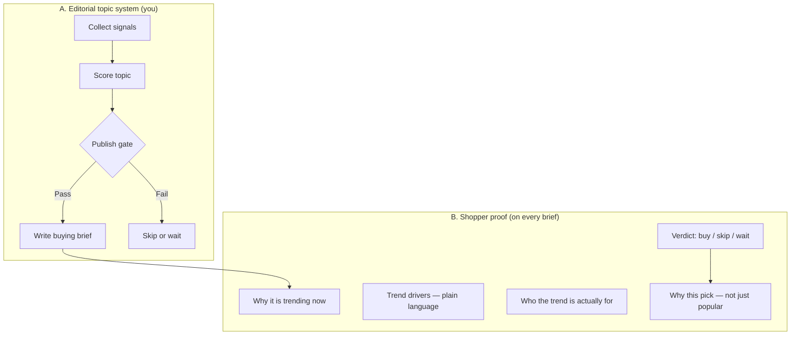

# HotPick Lab — Trend Topic System & Shopper Proof Framework

> **Purpose:** Turn “why things go viral” into (1) a repeatable **editorial topic system** and (2) **shopper-visible proof** so new buyers understand the trend — and feel confident their choice fits *them*, not the hype.

---

## 1. System overview (two halves)



| Half | Audience | Output |
|------|----------|--------|
| **A. Topic system** | You (editor) | Scored topic queue, publish/skip decisions |
| **B. Shopper proof** | US shopper / creator | “I understand the trend” + “This fits me” |

**Principle:** We do not manufacture hype. We **explain** hype, then **filter** it for the reader.

---

## 2. Why trends form — the logic we publish (shopper language)

Every US viral product wave usually stacks **4–5 drivers**. Not all must be present; we name which ones apply.

| Driver | What it means (shopper copy) | Example |
|--------|------------------------------|---------|
| **Social proof cascade** | Many creators posted it in a short window — it *looks* everywhere | Handheld fans in July |
| **Demo moment** | One video shows an obvious before/after or “life hack” | Nugget ice, neck fan |
| **Low regret price** | Typical impulse band ~$15–$80 on Amazon | Owala, mini fan |
| **Identity / aesthetic fit** | Product signals a lifestyle ( gym, dorm, clean girl, creator ) | Stanley tumbler |
| **Season or event** | Heat, back-to-school, Prime Day, launch cycle | Prime Day, summer cooling |
| **Platform halo** | Discovered on TikTok, bought on Amazon | Most “Amazon finds” |

**What trends are *not* (we say this explicitly):**

- Not proof the product is best in class  
- Not proof *you* need it  
- Not the same as long-term quality (that shows up in returns and “worth it?” searches later)

**Our role:** Catch readers in the **second wave** — after discovery, before or during purchase — when they search *worth it*, *vs*, *best for*.

---

## 3. Topic selection scorecard (internal)

Use this **before** writing. Minimum **18/30** to publish; **24+** = priority.

### 3.1 Five dimensions (0–6 each)

| # | Dimension | 0 | 3 | 6 |
|---|-----------|---|---|---|
| **D1** | **Purchase intent** | No one searches to buy | Some “best / vs” queries | Strong “worth it / vs / best for” volume |
| **D2** | **Trend signal** | Dead or fake viral | Rising in one channel | Multi-channel + seasonal tailwind |
| **D3** | **Decision clarity** | Cannot honestly say skip | Can narrow to 2 audiences | Clear buy / skip / wait for defined groups |
| **D4** | **Monetization fit** | No affiliate path | Amazon only, low % | Amazon + tools OR SaaS recurring |
| **D5** | **Proof we can show** | Pure speculation | Specs + buyer pattern research | + comparison table, pitfalls, update path |

### 3.2 Trend signal checklist (yes/no → feeds D2)

| Signal source | What to look for |
|---------------|------------------|
| Search | Google/Bing rise for “[product] worth it”, “[A] vs [B]” |
| Social | TikTok/Reddit cluster in last 30–60 days (not one old viral hit) |
| Retail | Amazon BSR movement, “#1 Best Seller” badges in subcategory |
| Season | Weather, holidays, Prime Day, product launch |
| Creator economy | Affiliate posts, TikTok Shop cards, “Amazon finds” format |

**Red flags (auto-hold):**

- Only meme attention, no purchase intent  
- Known scam / safety recall cluster  
- Cannot find 2 comparable products for a fair brief  
- We cannot write an honest skip list  

### 3.3 Topic queue template

| Field | Example |
|-------|---------|
| Working title | Stanley vs Owala — Worth It? (2026) |
| Primary persona | Pre-purchase Amazon shopper |
| D1–D5 scores | 5, 6, 5, 4, 5 → **25/30** |
| Active drivers | Social proof, identity, demo, platform halo |
| Verdict type (expected) | Buy one of two — skip if you don’t drink water on the go |
| Priority | P0 / P1 / P2 |
| Target publish | Before peak or within 14 days of signal |

---

## 4. Shopper proof — page architecture (every brief)

New readers should get **trust in 60 seconds**. Fixed module order:

```
┌─────────────────────────────────────────────────────────┐
│ 1. QUICK VERDICT BOX (above the fold)                   │
│    Buy / Skip / Wait · Best for · Skip if · Updated     │
├─────────────────────────────────────────────────────────┤
│ 2. WHY IT IS TRENDING (explain the wave)                │
│    2–4 sentences + which drivers apply (tags)           │
├─────────────────────────────────────────────────────────┤
│ 3. TREND vs TRUTH (the proof section)                   │
│    What the trend gets right · What it exaggerates      │
├─────────────────────────────────────────────────────────┤
│ 4. WHO SHOULD RIDE THE TREND / WHO SHOULD IGNORE IT     │
│    (existing whoItsFor / whoShouldSkip — keep)          │
├─────────────────────────────────────────────────────────┤
│ 5. BEFORE YOU BUY (pitfalls)                            │
├─────────────────────────────────────────────────────────┤
│ 6. COMPARED PICKS (2–4) + why we picked each            │
│    Not “#1 best seller” alone — fit-based reason        │
├─────────────────────────────────────────────────────────┤
│ 7. WHY YOU CAN FEEL GOOD ABOUT THIS CHOICE              │
│    Reframe: right for your use case, not because viral  │
└─────────────────────────────────────────────────────────┘
```

### 4.1 Module copy patterns

**2. Why it is trending**

> *[Product]* spiked because *[driver 1]* and *[driver 2]*. Short-form videos made the benefit obvious in seconds, and the price sits in an impulse-friendly range — so many buyers tried it at once. That visibility snowballed on Amazon.

**3. Trend vs truth**

| The trend says… | The fuller picture |
|-----------------|-------------------|
| “Everyone needs this.” | Only if you *[specific use case]*. |
| “Life-changing.” | Genuinely helpful for *[X]*; overkill for *[Y]*. |
| “Sold out everywhere.” | Popularity ≠ best fit for *you*. |

**7. Why you can feel good about this choice**

> You are not buying because it went viral. You are buying because *[specific need]* matches *[pick]* — and you already ruled out *[skip case]*.

---

## 5. Data model sketch (for `trends.json` — Phase 2)

Extend each brief when we implement on-site:

```json
{
  "trendDrivers": ["social-proof", "demo-moment", "identity-fit", "seasonal"],
  "trendVsTruth": {
    "trendSays": ["Everyone needs a Stanley", "Best water bottle ever"],
    "fullPicture": [
      "Only worth it if you carry drinks all day",
      "Owala may fit car cup holders better"
    ]
  },
  "verdict": {
    "action": "buy",
    "summary": "Buy Owala if you want straw + cup-holder fit; Stanley if aesthetics and capacity matter more.",
    "bestFor": "Daily commuters who drink 40+ oz cold water",
    "skipIf": "You already own a good bottle or only drink at home"
  },
  "topicScore": {
    "d1": 5, "d2": 6, "d3": 5, "d4": 4, "d5": 5,
    "total": 25,
    "scoredAt": "2026-07-04"
  },
  "signalNotes": "July heat + TikTok 'water bottle' cluster; rising 'stanley vs owala' searches."
}
```

**Shopper-visible:** `trendDrivers`, `trendVsTruth`, `verdict`, `whyHot` (rewritten), `signalNotes` (short public version).

**Internal-only:** `topicScore` → move to `trends-ops.json` if we split ops data again.

---

## 6. Driver tag glossary (UI labels)

| Internal key | Shopper-facing label |
|--------------|----------------------|
| `social-proof` | Lots of people posting it |
| `demo-moment` | Easy to see why it works in a video |
| `low-regret-price` | Low risk to try |
| `identity-fit` | Matches a lifestyle aesthetic |
| `seasonal` | Timing (heat, holidays, sales) |
| `platform-halo` | TikTok discovery → Amazon purchase |
| `launch-cycle` | New product / accessory wave |

---

## 7. Worked example — Stanley vs Owala

### Internal scorecard

| Dimension | Score | Note |
|-----------|-------|------|
| D1 Purchase intent | 6 | “stanley vs owala worth it” |
| D2 Trend signal | 6 | Multi-year social + seasonal summer |
| D3 Decision clarity | 5 | Clear skip: home-only drinkers |
| D4 Monetization | 4 | Amazon ~4–8% |
| D5 Proof | 5 | Comparison + pitfalls |
| **Total** | **26** | Publish P0 |

**Active drivers:** social-proof, identity-fit, demo-moment, platform-halo, seasonal

### Shopper-facing modules (draft)

**Verdict:** **Buy one — not both.** Owala for straw + portability; Stanley for capacity + aesthetic. **Skip** if you do not carry a bottle daily.

**Why trending:** Water bottles became identity props on TikTok; Stanley and Owala are visually distinct in GRWM and gym content. Summer heat + “hydration girl” aesthetic pushed both into Amazon best-seller lists at once.

**Trend vs truth:**

| Trend | Truth |
|-------|-------|
| “You need a viral bottle.” | You need *a* bottle you will actually use. |
| “Stanley is always better.” | Stanley wins on size/vibe; Owala wins on sipping + cleaning. |

**Why your choice is right:** Picking Owala because you commute with a straw lid is a **use-case** decision — not copying a trend. Skipping Stanley because you hate bulky bags is equally valid.

---

## 8. Editorial workflow (weekly)

| Step | When | Action |
|------|------|--------|
| 1. Scan | Mon | Run signal checklist on 5–10 candidates |
| 2. Score | Mon | Fill scorecard; queue P0/P1 |
| 3. Draft | Tue–Wed | Write brief using §4 module order |
| 4. Proof pass | Wed | “Would a skeptic believe our trend explanation?” |
| 5. Publish | Thu | Ship + IndexNow |
| 6. Review | 30 days | Update verdict if returns/hype narrative shifted |

---

## 9. Success metrics

| Metric | Meaning |
|--------|---------|
| Time on page / scroll to verdict | Reader found the decision |
| Affiliate CTR *after* verdict section | Informed click, not hype click |
| Rankings for `worth it` / `vs` | Capturing wave 2 search |
| Return mentions in reviews (manual spot-check) | Our skip lists matched reality |
| Repeat visitors | Trust in the brand, not one article |

---

## 10. Implementation roadmap

| Phase | What | Where |
|-------|------|-------|
| **Phase 0** | This framework doc | `docs/TREND_SYSTEM_FRAMEWORK.md` |
| **Phase 1** | Add `trendDrivers`, `trendVsTruth`, `verdict` to 2 pilot briefs | `trends.json` + `[slug].astro` |
| **Phase 2** | Verdict box + Trend vs Truth UI components | `TrendProof.astro`, `VerdictBox.astro` |
| **Phase 3** | Internal ops scores in `trends-ops.json` | Not on public site |
| **Phase 4** | `/methodology#trend-drivers` link from every brief | Already have `/methodology` |

---

## 11. One-line brand promise (shopper-facing)

> **We explain why it is trending — then help you decide if the trend fits you.**

That is the difference between an affiliate list and a site worth bookmarking.
